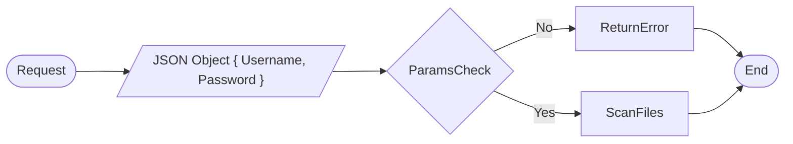
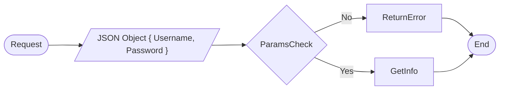

### User Files Scan



### User Space Info



### User Files Delete

```mermaid
flowchart LR
	Start([Request]) --> UserInfo[/"JSON Object { Username, Password }"/] --> ParamsCheck{ParamsCheck}
	ParamsCheck --> |No| ReturnError[ReturnError] --> End([End])
	ParamsCheck --> |Yes| ScanFiles --> End
