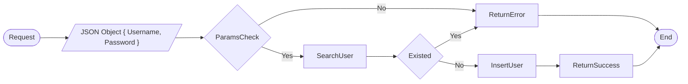
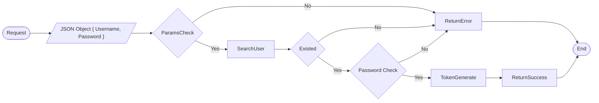

### Regular User Register


```mermaid
flowchart LR
	Start([Request]) --> UserInfo[/"JSON Object { Username, Password }"/] --> ParamsCheck{ParamsCheck}
	ParamsCheck --> |No| ReturnError[ReturnError] --> End([End])
	ParamsCheck --> |Yes| SearchUser[SearchUser] --> Existed{Existed}
	Existed --> |Yes| ReturnError
	Existed --> |No| InsertUser[InsertUser] --> ReturnSuccess[ReturnSuccess] --> End
```

- If there are any server internal errors, it will return 500 to frontend immediately.

### User Login


```mermaid
flowchart LR
	Start([Request]) --> UserInfo[/"JSON Object { Username, Password }"/] --> ParamsCheck{ParamsCheck}
	ParamsCheck --> |No| ReturnError[ReturnError] --> End([End])
	ParamsCheck --> |Yes| SearchUser[SearchUser] --> Existed{Existed}
	Existed --> |No| ReturnError
	Existed --> |Yes| Password{Password Check} --> |No| ReturnError
	Password --> |Yes| TokenGenerate --> ReturnSuccess[ReturnSuccess] --> End
```

### User Logout

```mermaid
```

